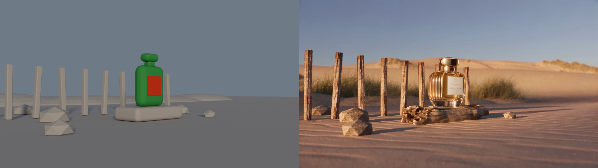

# GPT-6 + Blender + Higgsfield: camera to video

An educational perfume-film project showing how explicit Blender camera animation guides an AI-generated video. The repository includes a browsable tool guide, the production account, selected media and a reproducible greybox scene.

Inspired by [this YouTube tutorial on the Blender + Higgsfield workflow (starting at 5:38)](https://www.youtube.com/watch?v=OFvi-pvHmbo&t=338s). This project independently explores and documents that workflow through a perfume-film example.

## The workflow in two minutes

The starting point was a brief for a luxury perfume advertisement with four camera shots. A separate image-generation step produced the approved ATELIER VESPER bottle reference. **GPT-6 Astra coordinated the work:** it reconciled the instructions, wrote Blender Python and prepared the visual-generation prompt.

**Blender built and filmed a simple rehearsal set.** The Python created a stationary bottle proxy, support, posts, rocks and dunes, plus four animated cameras. Blender rendered 432 frames; FFmpeg encoded them into an 18-second guide MP4.

**The Higgsfield CLI sent the guide video, bottle PNG and appearance prompt to Seedance 2.5 Edit.** Seedance used the visible staging and movement to generate detailed glass, gold, sand and wood. It received pixels—not the `.blend` file, meshes or camera coordinates. This does not establish native Blender-file support or anything about its training dataset.

**The assistant reviewed; local tools finished.** A pilot tested the handoff, the full job generated the film, and one correction removed an unwanted ocean strip. Python and FFmpeg restored exact cut timing and an ending hold, producing the final 18-second, 1080p, 24 fps video.

Remember: **Astra plans → Python instructs → Blender stages and films → CLI transports → Seedance generates appearance → local tools finish and verify.** Generation MCP supported read-only preflight; the Blender plugin/live bridge was not used in production. The `.blend` remains the editable guide, not the finished photoreal world.

**[Open the live GitHub Pages site](https://az9713.github.io/gpt-6-blender-higgsfield/)** · **[Watch the camera demonstration](https://az9713.github.io/gpt-6-blender-higgsfield/#demo)**

[](https://az9713.github.io/gpt-6-blender-higgsfield/#demo)

The image above opens the live video player. GitHub's README displays this linked preview; the playable MP4 is hosted on GitHub Pages.

## Watch and learn

| Resource | Live page |
|---|---|
| Camera-to-video demonstration | [Watch](https://az9713.github.io/gpt-6-blender-higgsfield/#demo) · [MP4](https://az9713.github.io/gpt-6-blender-higgsfield/blender_camera_to_final_video.mp4) |
| Tool-by-tool learning guide | [Read](https://az9713.github.io/gpt-6-blender-higgsfield/perfume-tools-learning-guide.html) |
| Complete execution record | [Read](https://az9713.github.io/gpt-6-blender-higgsfield/perfume-workflow-execution.html) |
| Preflight and decisions | [Read](https://az9713.github.io/gpt-6-blender-higgsfield/perfume-video-preflight.html) |
| Python vs plugin/bridge vs CLI | [Read](https://az9713.github.io/gpt-6-blender-higgsfield/blender-python-vs-higgsfield-bridge.html) |
| Final film and QA | [Open](https://az9713.github.io/gpt-6-blender-higgsfield/production/index.html) |

## What controls what?

GPT-6 Astra coordinated the work and wrote local Blender Python. Blender rendered a camera/staging guide. The Higgsfield CLI submitted the guide, approved bottle image and prompt to Seedance 2.5 Edit. Local Python and FFmpeg conformed the resulting timing.

Blender defines the **guide's** movement. Seedance interprets that guide, so the generated result is not guaranteed to reproduce exact camera motion, geometry or typography. The screen-recorded players are not frame-synchronized. The final film is 18 seconds, 1080p, 24 fps, with four shots.

Generation MCP was used for read-only preflight checks. The Blender plugin/live bridge was not used for production. The live bridge is a capability of the plugin, not a second Blender plugin.

## Reproduce locally

Open [the Blender scene](production/perfume-world.blend), select frame 1, and use Camera Perspective (Numpad 0). Or build it using Blender 5.2.1 LTS:

```powershell
blender --background --factory-startup --python-exit-code 1 --python build_perfume_world.py
```

Use a clean background process: the script replaces scene objects. Add `-- --render` to render all 432 PNG frames; `python production/encode_guides.py` encodes the guide with FFmpeg. Frame processing helpers require Python, OpenCV and NumPy. New cloud generations require your own authenticated account and credits.

## Public scope

Included: public editions of the HTML guides, approved reference image, privacy-edited demonstration, guide/final MP4s, Blender scene, selected source and QA artifacts.

Excluded: authentication data, account balances, cloud job/media identifiers, private transcripts, desktop screenshots, raw job logs, installed skills and the full PNG sequence. The screen recording has its title bar masked, audio removed and metadata stripped. A file-browser directory string was cleared from the public Blender copy; the scene was then re-opened for validation.

These are project records and educational examples, not an endorsement or a guarantee of exact generative fidelity. No third-party model or plugin software is redistributed.
